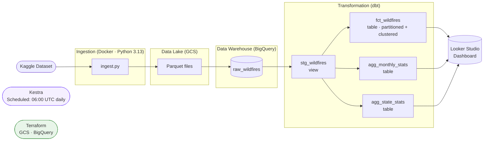

# US Wildfire Analytics Pipeline

An end-to-end data engineering pipeline that ingests the US wildfire dataset from Kaggle, stores it in a GCS data lake, loads it into BigQuery, transforms it with dbt, and visualises results in Looker Studio.

## Architecture



## Technology Stack

| Layer | Tool |
|---|---|
| Infrastructure | Terraform, Google Cloud Platform |
| Data Lake | Google Cloud Storage (Parquet files) |
| Data Warehouse | BigQuery |
| Ingestion | Python 3.13, uv, pandas, pyarrow |
| Orchestration | Kestra |
| Transformation | dbt (dbt-bigquery) |
| Visualisation | Looker Studio |
| Containerisation | Docker, Docker Compose |

## Dataset

**FW_Veg_Rem_Combined** — US wildfire records with weather and vegetation attributes, sourced from [Kaggle](https://www.kaggle.com). Each row represents a single fire event and includes:

- Discovery and containment dates
- Fire size (acres) and size class (A–G)
- State and coordinates
- Ignition cause
- Pre-fire and at-containment weather conditions (temperature, wind, humidity, precipitation)
- Vegetation type and remoteness score

## Project Structure

```
project/
├── Makefile                   # Common task shortcuts
├── .env.example               # Environment variable template
├── terraform/                 # GCP infrastructure (GCS + BigQuery)
├── docker/
│   ├── docker-compose.yaml    # Ingestion and dbt services
│   ├── ingestion/             # Python ingestion pipeline
│   └── dbt/                   # dbt Docker image
├── kestra/
│   ├── docker-compose.yaml    # Kestra orchestrator
│   └── flows/
│       └── wildfire_pipeline.yaml
├── dbt_wildfire/              # dbt project (wildfire_analytics)
│   ├── models/
│   │   ├── staging/           # stg_wildfires (view)
│   │   └── marts/             # fct_wildfires, agg_monthly_stats, agg_state_stats (tables)
│   └── macros/
│       └── fire_size_class.sql
└── dashboard/
    └── screenshots/
```

## Prerequisites

- [Docker](https://docs.docker.com/get-docker/) and Docker Compose
- [Terraform](https://developer.hashicorp.com/terraform/install) >= 1.6
- A GCP project with a service account key that has roles:
  - `Storage Admin`
  - `BigQuery Admin`
- A [Kaggle API token](https://www.kaggle.com/settings/account) (`KAGGLE_USERNAME` + `KAGGLE_API_TOKEN` — set in `.env`)

## Setup

### 1. Configure environment variables

```bash
make setup          # copies .env.example → .env
```

Edit `.env` and fill in all required values:

```env
GCP_PROJECT_ID=your-project-id
GCS_BUCKET_NAME=your-bucket-name
BQ_DATASET=wildfire_data
GCP_REGION=us-central1
GOOGLE_APPLICATION_CREDENTIALS=./secrets/gcp-key.json
KAGGLE_USERNAME=your-kaggle-username
KAGGLE_KEY=your-kaggle-api-key
```

Place your GCP service account key at `secrets/gcp-key.json`.

### 2. Provision GCP infrastructure

```bash
cp terraform/terraform.tfvars.example terraform/terraform.tfvars
# Edit terraform.tfvars with your project_id, bucket name, etc.

make tf-init        # terraform init
make tf-apply       # creates GCS bucket + BigQuery dataset
```

### 3. Build Docker images

```bash
make build
```

## Running the Pipeline

### Run all steps in sequence

```bash
make pipeline       # ingest → dbt run → dbt test
```

### Run steps individually

```bash
make ingest         # Download from Kaggle, upload Parquet to GCS, load into BigQuery raw_wildfires
make dbt-run        # Run all dbt models (staging + marts)
make dbt-test       # Run all dbt data quality tests
```

## Orchestration with Kestra

The full pipeline can be run on a schedule using Kestra.

```bash
make kestra-up      # Start Kestra at http://localhost:8080
make kestra-down    # Stop Kestra
```

The flow `wildfire_pipeline` (namespace `de_zoomcamp`) runs three tasks in sequence:

1. **ingest_to_gcs_and_bq** — runs the ingestion Docker container
2. **dbt_run** — runs dbt transformations
3. **dbt_test** — validates data quality

A daily schedule trigger (`0 6 * * *`) is included but disabled by default. Enable it in [`kestra/flows/wildfire_pipeline.yaml`](kestra/flows/wildfire_pipeline.yaml).

## Data Transformations (dbt)

The dbt project is named `wildfire_analytics` and connects to BigQuery using a service account.

### Staging layer (`materialized: view`)

| Model | Description |
|---|---|
| `stg_wildfires` | Cleans and type-casts raw wildfire records. Renames columns to snake_case, casts dates/floats, excludes rows with null discovery dates, and computes `fire_duration_days`. |

### Marts layer (`materialized: table`)

| Model | Description |
|---|---|
| `fct_wildfires` | One enriched row per fire event. **Partitioned** by `discovery_date` (monthly), **clustered** by `state` and `cause`. Adds date parts (quarter, month name, day of week) and human-readable fire size labels via the `size_class_label` macro. |
| `agg_monthly_stats` | Fire counts, total/average/max acres burned, and average duration — aggregated by year, month, and state. Used by the temporal dashboard tile. |
| `agg_state_stats` | Fire counts, acres burned, and size-class breakdown — aggregated by state and cause. Used by the categorical dashboard tile. |

### Macro

`size_class_label(column_name)` converts single-letter NWCG size class codes (A–G) into human-readable labels (e.g. `"5,000+ acres"`).

### dbt tests

- `not_null` and `unique` on all surrogate keys
- `not_null` on all business-critical columns (date, state, fire size)
- `accepted_values` on `fire_size_class` (A–G)

## Dashboard

The Looker Studio dashboard connects directly to the BigQuery mart tables and includes:

- Fire counts and total acres burned over time (monthly trend)
- Top states by fire count and acres burned
- Fire cause breakdown
- Fire size class distribution

Screenshots are in [`dashboard/screenshots/`](dashboard/screenshots/).

## Teardown

```bash
make tf-destroy     # Remove GCS bucket and BigQuery dataset
make clean          # Remove local Docker images, volumes, and dbt artefacts
```
